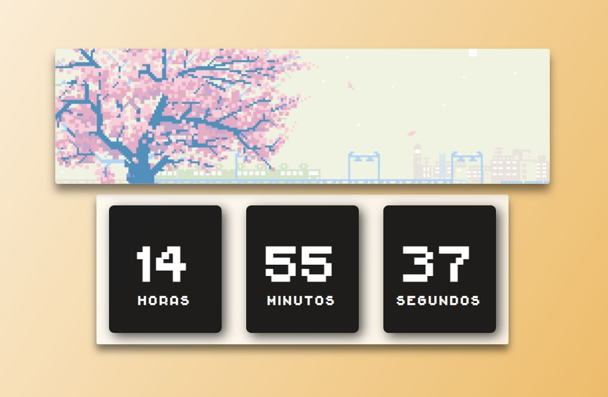
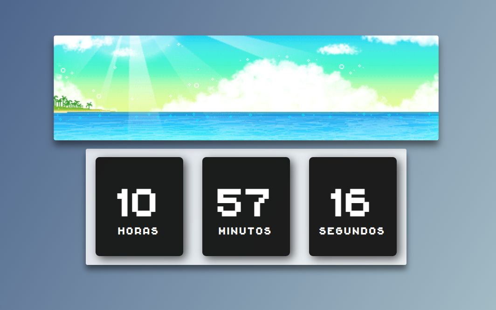
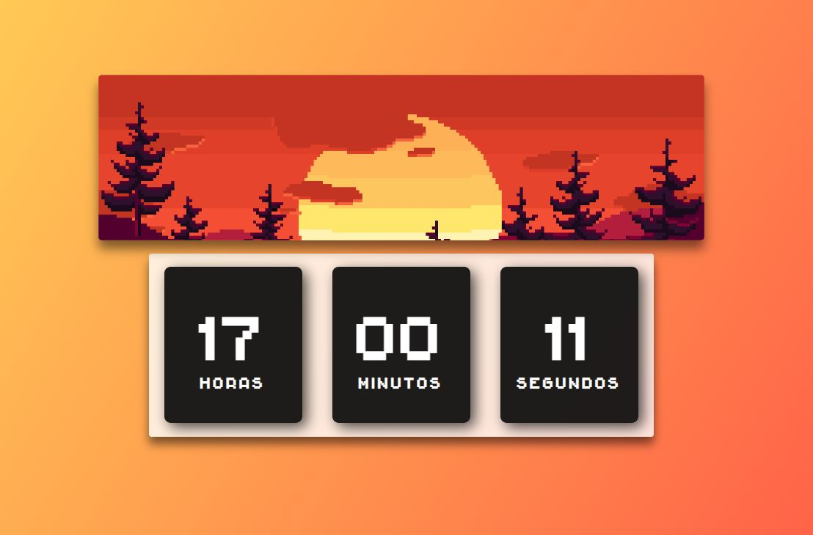
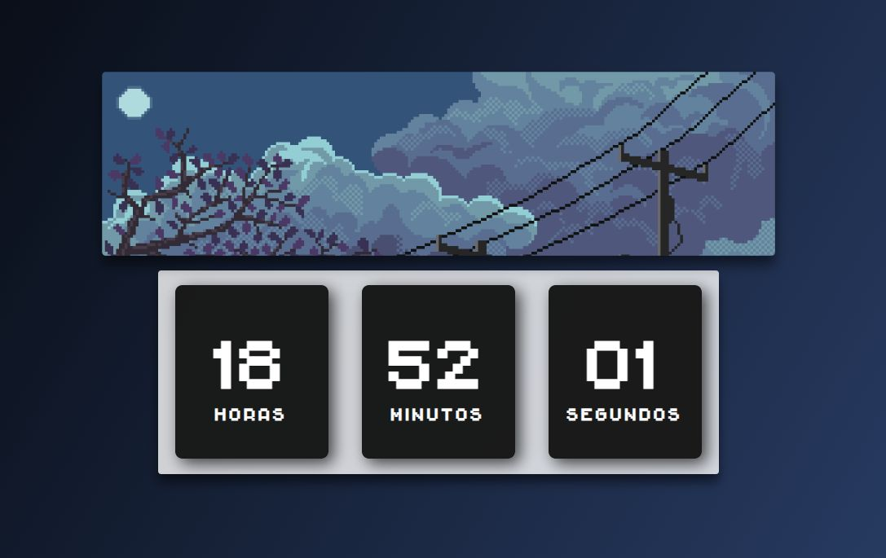
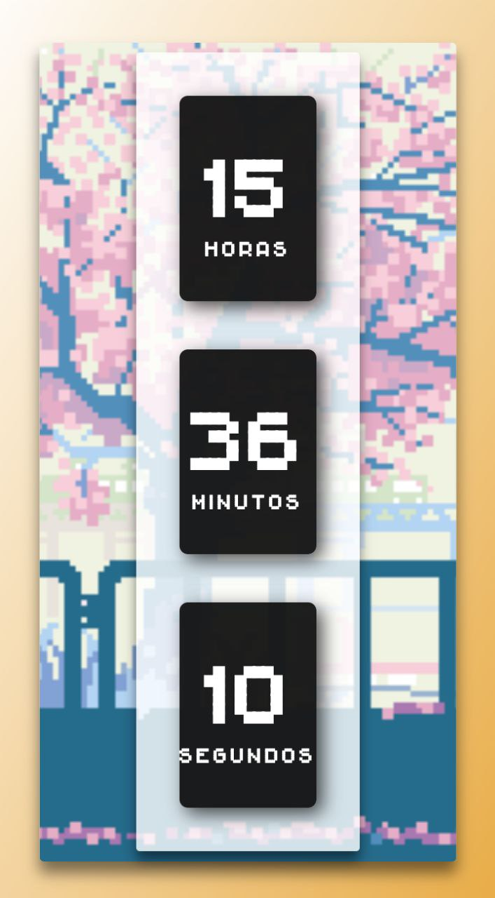
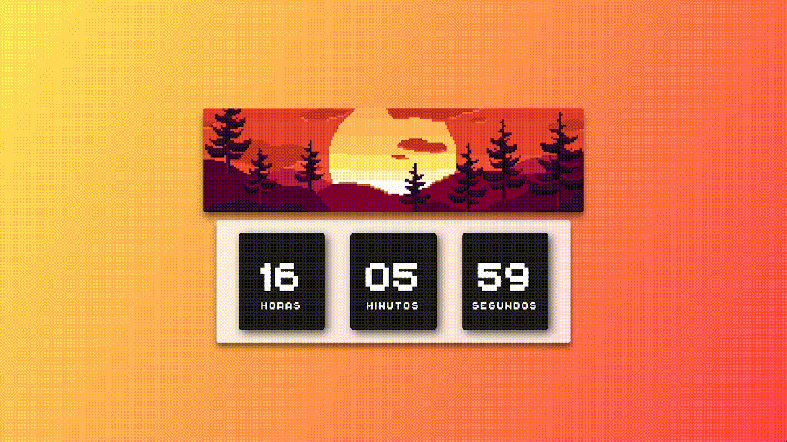

# Relogio Digital

[Gabriel Soares](https://www.linkedin.com/in/gabriel-soares-3098782b0/)

> 
> 
> 
> 

 

> 

> 

---

## Sobre
Este projeto é um **relógio digital** simples e funcional, desenvolvido para mostrar a hora atual de forma clara e precisa. O relógio é atualizado em tempo real, exibindo a hora, minutos e segundos.

---

## Funcionalidades
- **Exibição da Hora Atual**: Mostra a hora, minutos e segundos.
- **Atualização em Tempo Real**: A hora é atualizada automaticamente a cada segundo.
- **Design Simples e Limpo**: Layout minimalista para fácil leitura.
